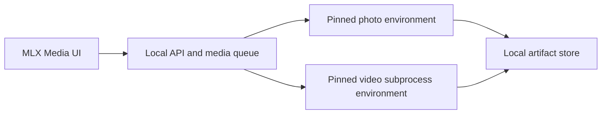

# MLX Video integration audit

This document records the verified boundary between **MLX Media** and the public
[`Blaizzy/mlx-video`](https://github.com/Blaizzy/mlx-video) project. It is an
implementation plan, not a claim that video generation is available in this repository.

## Current product status

- The React interface includes a video workflow preview and a typed capability contract.
- The submit button is intentionally disabled.
- No video model is installed or downloaded by the frontend.
- No `mlx-video` dependency has been added to the photo environment.
- Existing photo and SeedVR2 jobs remain the proven runtime path.

The upstream source was reviewed at commit
`87db56a51758fefb748a359b90a5283bb8ba4837` (2026-05-13). Before any runner is
enabled, that revision must be pinned explicitly and re-audited or replaced by another
reviewed revision.

## Verified upstream boundary

The upstream package is early-stage (`0.0.1`), MIT-licensed code with no tagged GitHub
release at the time of review. It exposes command-line entry points and synchronous
Python generation functions. It does **not** provide a web server, a job queue, a
stable progress callback, or a safe cancellation protocol.

| Family | Verified upstream operations | Important constraints | Weight license |
| --- | --- | --- | --- |
| LTX-2 / 2.3 | Text-to-video, image-to-video, first/end-frame conditioning, audio-to-video, optional generated audio, LoRA, two-stage upscaling | Frame count is `1 + 8k`; dimensions are pipeline-dependent multiples of 32 or 64 | LTX-2 Community License; review required before model download or use |
| Wan 2.1 | Text-to-video and checkpoint-dependent image-to-video | Converted local model directory; frame count is `4n + 1` | Official weights use Apache-2.0 |
| Wan 2.2 | Text-to-video and image-to-video; single/dual model paths, LoRA, Euler/DPM++/UniPC schedulers | Converted local model directory; frame count is `4n + 1` | Official weights use Apache-2.0 |

Open upstream reports currently include LTX-2.3 image/audio regressions and Wan 2.2
quantized output artifacts. See the live [issue tracker](https://github.com/Blaizzy/mlx-video/issues)
and [pull requests](https://github.com/Blaizzy/mlx-video/pulls). A model family is not
“ready” merely because its class exists upstream.

## Dependency and runtime isolation

MLX Media's photo runtime pins MFLUX, MLX, `mlx-vlm`, `mlx-lm`, Transformers and
OpenCV versions. `mlx-video` carries its own overlapping dependency graph. Installing
it into the same environment risks silently breaking photo generation and restoration.

The safe architecture is:

Requirements:

1. Pin the video engine to an audited source revision. Do not install an unrelated
   package from an unqualified `pip install mlx-video` command.
2. Run video in a separate virtual environment and subprocess.
3. Serialize photo and video work through the existing media queue so two large models
   never fight over unified memory.
4. Return artifact metadata and a local artifact URL; do not move video through JSON as
   base64.
5. Make model license acknowledgement explicit. Do not auto-accept gated terms.

## Proposed versioned API contract

The UI consumes a server-owned capability registry instead of hard-coding a universal
form. Every capability reports availability and a reason, pinned engine revision and
test state, isolation and cancellation modes, model cache/configuration state,
operation flags, parameter ranges, output/audio features, and license information.

| Method | Route | Purpose |
| --- | --- | --- |
| `GET` | `/api/v1/video/capabilities` | Versioned model and operation registry |
| `GET` | `/api/v1/video/status` | Isolated runner, dependency and active-media-job state |
| `POST` | `/api/v1/generate` | Existing queue submission with `type: "video"`, `operation`, and `capability_id` |
| `GET` | `/api/v1/jobs/{id}` | Existing job status endpoint |
| `GET` | `/api/v1/jobs/{id}/stream` | Existing SSE channel; events must reflect actual runner state |
| `DELETE` | `/api/v1/jobs/{id}` | Queued cancellation only until cooperative runner cancellation is proven |

The corresponding frontend-only TypeScript contract lives in
`frontend/src/videoApi.ts`. These endpoints are **proposed**; the current backend does
not advertise or accept video jobs.

## Staged delivery plan

### Stage 0 — discovery and status

- Serve the versioned capability registry and runner status.
- Keep every capability unavailable with a precise reason until locally verified.
- Add dependency, architecture and Apple-silicon preflight checks.

### Stage 1 — queue contract

- Add a fake runner that exercises submission, serialized queueing, artifacts and SSE.
- Permit cancellation only while queued.
- Prove that photo jobs remain unchanged and retain priority.

### Stage 2 — one proven path

- Pin one engine revision and one exact model checkpoint.
- Begin with one conservative text-to-video operation.
- Add golden-input smoke tests for dimensions, frame count, container validity and
  deterministic metadata.
- Enable the UI action only for the passing capability.

### Stage 3 — model expansion

- Add image/audio conditioning one family at a time.
- Add checkpoint-aware defaults rather than generic controls.
- Validate quality, memory use, model download state, and weight license for each path.

### Stage 4 — honest progress and cancellation

- Expose subprocess stages only when they correspond to observable work.
- Add cooperative running cancellation only after the subprocess actually stops and
  partial artifacts are cleaned safely.
- Defer advanced downloads, codecs, generated audio and LoRA controls until covered by
  isolated tests.

## Release gate

A capability may be labelled **Ready** only when its exact engine revision and model
checkpoint are pinned, the model is configured and cached, a local Apple-silicon smoke
test produces a valid artifact, the relevant license has been acknowledged, and photo
regression tests still pass. Until then the product must say **Preview**, **Setup
required**, or **Unavailable** with the reason.
