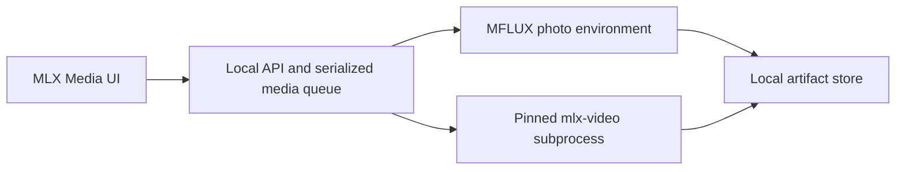

# MLX Video integration

MLX Media exposes one deliberately narrow, locally verified video path through the
public [`Blaizzy/mlx-video`](https://github.com/Blaizzy/mlx-video) project. The video
runtime is isolated from MFLUX so its MLX and Transformers versions cannot silently
break the established photo and SeedVR2 workflows.

## Supported mode

| Setting | Verified value |
| --- | --- |
| Capability | `wan-2.1-t2v-1.3b` |
| Operation | Text to video |
| Engine | `mlx-video` commit `87db56a51758fefb748a359b90a5283bb8ba4837` |
| Model | `Wan-AI/Wan2.1-T2V-1.3B` revision `37ec512624d61f7aa208f7ea8140a131f93afc9a` |
| Tokenizer | `google/umt5-xxl` revision `66cb9e7e85526fe440a945569e42c72fb6cbc0ad` |
| Output | MP4, 832 x 480, 16 fps |
| Frames | `4n + 1`, from 5 through 81 |
| Sampler | UniPC, 1 through 50 steps, 10-step default |
| License | MIT engine code; Apache-2.0 model weights |

Image-to-video, audio-to-video, LTX, Wan 2.2, LoRA and arbitrary output sizes are not
advertised. Their presence in upstream source is not evidence that this product has
tested them.

## Local verification

The pinned five-frame, ten-step smoke profile completed on a 128 GB Apple-silicon Mac
in about 37 seconds and produced a coherent, readable 832 x 480 MP4. This is a
qualification of that machine and exact profile, not a performance promise for other
Macs. The setup preflight conservatively requires at least 64 GB of unified memory and
40 GiB free disk until more machines have been measured.

The upstream Wan encoder emitted eight frames for a five-frame request. MLX Media
therefore validates the raw video, trims only the excess temporal tail, and validates
the final MP4 again for exact dimensions, frame count, frame rate and readable image
content before publishing it. A subprocess exit code alone is never accepted as proof
of a usable video.

## Runtime boundary

- Video dependencies live in a separate frozen virtual environment.
- Official source snapshots use the shared Hugging Face cache; converted weights live
  under that cache's MLX Media runtime area, never in Pinokio's models directory.
- Generation uses local model/tokenizer paths, an allowlisted process environment and
  Hugging Face/Transformers offline mode after provisioning. This prevents cache
  downloads and credential inheritance; it is not an operating-system network sandbox.
- Photo and video jobs use the same serialized media queue so large models do not
  compete for unified memory.
- Running cancellation terminates the isolated generator process group. Stage-boundary
  and final-publication checks remove partial or just-published artifacts if cancellation
  races with MP4 validation.
- Completed artifacts are served by local, validated API paths rather than filesystem
  paths or base64 JSON.

The Wan path currently upcasts its large text encoder during execution. Quantizing the
smaller diffusion transformer does not remove that memory pressure. Do not describe
this first integration as suitable for 16 GB or 24 GB Macs.

## Local API

| Method | Route | Purpose |
| --- | --- | --- |
| `GET` | `/api/v1/video/capabilities` | Exact server-owned capability and limits |
| `GET` | `/api/v1/video/status` | Pinned runtime, model, smoke-test and media-queue state |
| `POST` | `/api/v1/generate` | Submit the supported video request with `type: "video"` |
| `GET` | `/api/v1/jobs/{id}` | Read queue, progress and result state |
| `GET` | `/api/v1/jobs/{id}/stream` | Receive actual stage and denoising progress |
| `DELETE` | `/api/v1/jobs/{id}` | Cancel queued work or terminate a running video process |
| `GET` | `/api/v1/video/artifacts/{id}/{file}` | Read a validated local MP4 or provenance file |

All video routes are loopback-only. Request validation rejects unknown capabilities,
operations, parameters and filesystem paths. The server constructs the executable,
model and output paths from its own pinned runtime configuration.

## Provisioning

The source repository includes `scripts/setup_mlx_video_runner.py`. Its `plan` action
performs architecture, memory and disk checks without downloading a model. Its
`provision` action clones the audited engine revision, reproduces its frozen dependency
lock, downloads the exact model and tokenizer revisions into the shared cache,
converts the model to the isolated MLX runtime, and writes a hash manifest for every
converted artifact. Runtime readiness also requires a clean pinned engine checkout,
the exact tokenizer snapshot, unchanged model file state and a matching smoke artifact.

Provisioning is intentionally separate from the React interface. A setup failure must
leave video unavailable without changing the photo environment.

## Known limits

- Upstream is early-stage and has no tagged release at the pinned revision.
- Transformers reports an upstream tokenizer-regex compatibility warning. The verified
  smoke works, but prompt-quality comparisons should accompany a future engine update.
- Cancellation is process-level, not an upstream cooperative callback.
- Time Lens has no implemented research, retrieval or historical-grounding backend.
  Its interface must remain unavailable rather than simulate results.

Any additional model or operation needs its own pinned license review, Apple-silicon
memory measurement, real generation test, artifact validation and photo-regression
run before it can enter the capability registry.
